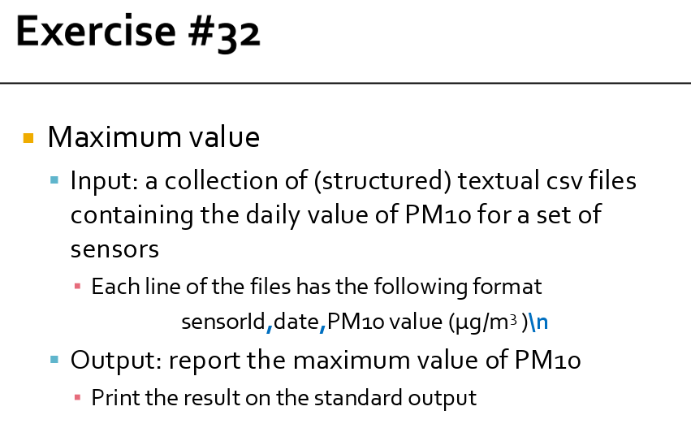
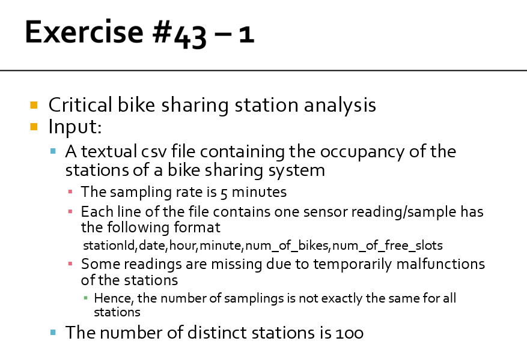

# Spark RDD-based exercises

## Ex 30

<p float="left">
    
    
</p>

```python
from pyspark import SparkConf, SparkContext

# Read the content of the input file
# Each element/string of the logRDD corresponds to one line of the input file
conf = SparkConf().setAppName("Log filtering")

sc = SparkContext(conf=conf)

inputPath  = "/data/students/bigdata-01QYD/ex_data/Ex30/data/"
outputPath = "res_out_Ex30/" 

# Read the content of the input file
# Each element/string of the logRDD corresponds to one line of the input file
logRDD = sc.textFile(inputPath)

# Only the elements of the RDD satisfying the filter are selected
googleRDD = logRDD.filter(lambda logLine: logLine.lower().find("google") >= 0)

# Store the result in the output folder
googleRDD.saveAsTextFile(outputPath)
```

---

## Ex 31

<p float="left">
    
    
</p>

#### difference between map() and flatmap()

`map()` and `flatMap()` are both Spark transformations used to apply a function to each element of an RDD, but they behave differently in terms of output structure.

1) map()
    - Transforms each input element into one output element.
    - The result is an RDD where each input element maps to a single transformed element.

    Example:

    ```python
    rdd = sc.parallelize(["hello", "world"])

    mapped_rdd = rdd.map(lambda x: x.upper())
    print(mapped_rdd.collect())

    # Output: ['HELLO', 'WORLD']

    ```

2) flatmap()
    - Transforms each input element into zero or more output elements.
    - The result is a flattened RDD where the transformation function returns an iterable, and Spark automatically expands (flattens) it.
    Example:

    ```python
    rdd = sc.parallelize(["hello world", "hi"])

    flat_mapped_rdd = rdd.flatMap(lambda x: x.split(" "))
    print(flat_mapped_rdd.collect())

    # Output: ['hello', 'world', 'hi']

    ```

- Use map() when each input element should correspond to exactly one output element.
- Use flatMap() when each input element may produce multiple outputs, or when flattening a list structure.

#### version with map()

```python
from pyspark import SparkConf, SparkContext

conf = SparkConf().setAppName("Ex 31")
sc = SparkContext(conf=conf)

inputPath  = "/data/students/bigdata-01QYD/ex_data/Ex31/data/"
outputPath = "res_out_Ex31/"

# Read the content of the input file
# Each element/string of the logRDD corresponds to one line of the input file
logRDD = sc.textFile(inputPath)

# Only the elements of the RDD satisfying the filter are selected
googleRDD = logRDD.filter(lambda logLine: logLine.lower().find("www.google.com")>=0)

# Use map to select only the IP address. It is the first field before -
IPsRDD = googleRDD.map(lambda logLine: logLine.split('-')[0])

# Remove duplicates
distinctIPsRDD = IPsRDD.distinct()

# Store the result in the output folder
distinctIPsRDD.saveAsTextFile(outputPath)
```

#### version with flatmap()

```python
from pyspark import SparkConf, SparkContext

conf = SparkConf().setAppName("Ex 31")
sc = SparkContext(conf=conf)

inputPath  = "/data/students/bigdata-01QYD/ex_data/Ex31/data/"
outputPath = "res_out_Ex31/"

# Read the content of the input file
# Each element/string of the logRDD corresponds to one line of the input file
logRDD = sc.textFile(inputPath)

def filterAndExtractIP(line):
    # Inizialize the list that will be returned by this function
    listIPs = []
    
    # If line contains www.google.com add the IP of this line in the returned list
    if line.lower().find("www.google.com")>=0:
        IP = line.split('-')[0]
        listIPs.append(IP)
        
    # return listIPs
    return listIPs

# Only the elements of the RDD satisfying the filter are selected
# and the associated IPs are returned
# Those lines that do not contain "www.google.com" return an empy list.
IPsRDD = logRDD.flatMap(filterAndExtractIP)

# Remove duplicates
distinctIPsRDD = IPsRDD.distinct()

# Store the result in the output folder
distinctIPsRDD.saveAsTextFile(outputPath)
```

---

## Ex 32

<p float="left">
    
    
</p>

1. We can use the take `takeOrdered(num)` action → since by default it uses the ascending order, we customize the sorting function by negating the elements. In this way we get the elements in descending order and we  only the first one. Keep in mind it returns a list even if there is only one element.
2. We can also use the `top(num)` action → it will retrieve the `num` largest elements in the collection. Of course, we will take only the first one. Same as before: keep in mind it returns a list even if there is only one element.
3. Firstly, with `map()` we retrieve all the values (the same as the examples before) and then with `reduce()` we take only the maximum value.

### version with takeOrdered()

```python
from pyspark import SparkConf, SparkContext

conf = SparkConf().setAppName("Ex 32")
sc = SparkContext(conf=conf)

inputPath  = "/data/students/bigdata-01QYD/ex_data/Ex32/data/"

# Read the content of the input file
readingsRDD = sc.textFile(inputPath)

# Extract the PM10 values
# It can be implemented by using the map transformation
# Split each line and select the third field
# Remember to convert it into a float, otherwise it will be a string
pm10ValuesRDD = readingsRDD.map(lambda PM10Reading: float(PM10Reading.split(',')[2]))

# Select the maximum PM10 value by using the takeOrdered action. We need to change the "sort function"
maxPM10Value = pm10ValuesRDD.takeOrdered(1, lambda n: -1*n)[0]

# Print the result on the standard output of the Driver program/notebook
print(maxPM10Value)

```

### version with top() action

```python
from pyspark import SparkConf, SparkContext

conf = SparkConf().setAppName("Ex 32")
sc = SparkContext(conf=conf)

inputPath  = "/data/students/bigdata-01QYD/ex_data/Ex32/data/"

# Read the content of the input file
readingsRDD = sc.textFile(inputPath)

# Extract the PM10 values
# It can be implemented by using the map transformation
# Split each line and select the third field
pm10ValuesRDD = readingsRDD.map(lambda PM10Reading: float(PM10Reading.split(',')[2]))

# Select the maximum PM10 value by using the top action
maxPM10Value = pm10ValuesRDD.top(1)[0]

# Print the result on the standard output of the Driver program/notebook
print(maxPM10Value)
```

### version with reduce()

```python
from pyspark import SparkConf, SparkContext

conf = SparkConf().setAppName("Ex 32")
sc = SparkContext(conf=conf)

inputPath  = "/data/students/bigdata-01QYD/ex_data/Ex32/data/"

# Read the content of the input file
readingsRDD = sc.textFile(inputPath)

# Extract the PM10 values
# It can be implemented by using the map transformation
# Split each line and select the third field
pm10ValuesRDD = readingsRDD.map(lambda PM10Reading: float(PM10Reading.split(',')[2]))

# Select/compute the maximum PM10 value
# The lambda function is applied in a pairwise fashion to combine the elements
# It compares two values and returns the larger one, progressively reducing the RDD.
maxPM10Value = pm10ValuesRDD.reduce(lambda value1, value2: max(value1,value2))

# Print the result on the standard output of the Driver program/notebook
print("maxPM10Value")
```

##### How `reduce()` Works for Finding the Maximum Value

Let's break down how `reduce()` works for finding the **maximum PM10 value**.

```python
maxPM10Value = pm10ValuesRDD.reduce(lambda value1, value2: max(value1, value2))
```

##### Step-by-Step Explanation

1. **Initial Values**:
   - `value1` and `value2` are the two values that are taken from the RDD.

2. **Lambda Function**:
   - The lambda function `lambda value1, value2: max(value1, value2)` compares `value1` and `value2` and returns the larger of the two. This comparison happens iteratively across the entire RDD.

##### Example with RDD values

If the RDD contains the following values:

```python
[35.2, 42.3, 28.7, 50.1, 60.4]
```

Here’s how the process works:

1. The first comparison is between `35.2` and `42.3`. The function returns `42.3`.
2. Next, it compares `42.3` and `28.7`. The function returns `42.3`.
3. Then, it compares `42.3` and `50.1`. The function returns `50.1`.
4. Finally, it compares `50.1` and `60.4`. The function returns `60.4`.

##### Final Result

After applying the `reduce()` function across all elements in the RDD, the maximum PM10 value, `60.4`, is returned.

---

## Ex 33

<p float="left">
    
    
</p>

### version with top()

```python
# Read the content of the input file
readingsRDD = sc.textFile(inputPath)

# Extract the PM10 values
# It can be implemented by using the map transformation
# Split each line and select the third field
pm10ValuesRDD = readingsRDD.map(lambda PM10Reading: float(PM10Reading.split(',')[2]))

# Select the top-3 values
top3PM10Value = pm10ValuesRDD.top(3)

# Print the result on the standard output of the Driver program/notebook
print(top3PM10Value)
```

### version with takeOrdered()

```python
# Select the top-3 values
top3PM10Value = pm10ValuesRDD.takeOrdered(3, lambda num: -num)
```

---

## Ex 34

<p float="left">
    
    
</p>

1. We first map the values and find the maximum with reduce. We then use this result to select from all the lines only those where the PM10 value is equal to this one (`filter()` action).
We used the `reduce()` method to find the maximum, but we could have used `top()` or `takeOrdered()` as in the example before without problems.
Be careful: we can use `takeOrdered()` or `top()` only to select the maximum value, not to select all the lines associated with the maximum value!

### version with reduce() and filter()

```python
from pyspark import SparkConf, SparkContext

conf = SparkConf().setAppName("Ex 34")
sc = SparkContext(conf=conf)

inputPath  = "/data/students/bigdata-01QYD/ex_data/Ex34/data/"
outputPath = "res_out_Ex34/"

# Read the content of the input file
readingsRDD = sc.textFile(inputPath)

# Extract the PM10 values
# It can be implemented by using the map transformation
# Split each line and select the third field
pm10ValuesRDD = readingsRDD.map(lambda PM10Reading: float(PM10Reading.split(',')[2]))

# Select/compute the maximum PM10 value
maxPM10Value = pm10ValuesRDD.reduce(lambda value1, value2: max(value1,value2))

# Filter the content of readingsRDD
# Select only the line(s) associated with the maxPM10Value
selectedRecordsRDD = readingsRDD.filter(lambda PM10Reading: float(PM10Reading.split(',')[2])==maxPM10Value)

# Store the result in the output folder
selectedRecordsRDD.saveAsTextFile(outputPath)
```

### version with takeOrdered()

```py
# Select/compute the maximum PM10 value by using takeOrdered
maxPM10Value = pm10ValuesRDD.takeOrdered(1, lambda num: -num)[0]
```

We only select the maximum and then nothing changes with respect to the previous version.

It would have been **WRONG** a solution like this:

```py
# Extract the top-1 result by using takeOrdered
# Consider the PM10 value to select the top-1 line
selectedRecords  = readingsRDD.takeOrdered(1, lambda PM10Reading: -1*float(PM10Reading.split(',')[2]))
# This solution is WRONG because it selects the first line associated with the maximum PM10 and 
# not all the lines (potentially more than one) associated with the maximum PM10 value 

# Transform the local list returned by top in to an RDD
selectedRecordsRDD = sc.parallelize(selectedRecords)
```

---

## Ex 35

<p float="left">
    
    
</p>

1. We find the maximum as before
2. We select only the lines with the maximum value
3. We extract the dates from those lines

```py
from pyspark import SparkConf, SparkContext

conf = SparkConf().setAppName("Ex 35")
sc = SparkContext(conf=conf)

inputPath  = "/data/students/bigdata-01QYD/ex_data/Ex35/data/"
outputPath = "res_out_Ex35/"

# Read the content of the input file
readingsRDD = sc.textFile(inputPath)

# Extract the PM10 values
# It can be implemented by using the map transformation
# Split each line and select the third field
pm10ValuesRDD = readingsRDD.map(lambda PM10Reading: float(PM10Reading.split(',')[2]))

# Select/compute the maximum PM10 value
maxPM10Value = pm10ValuesRDD.reduce(lambda value1, value2: max(value1,value2))

# Filter the content of readingsRDD
# Select only the line(s) associated with the maxPM10Value
selectedRecordsRDD = readingsRDD.filter(lambda PM10Reading: float(PM10Reading.split(',')[2])==maxPM10Value)

# Extract the dates from the selected records (second field of each string)
datesRDD = selectedRecordsRDD.map(lambda PM10Reading: PM10Reading.split(',')[1])

# Remove duplicates, if any
distinctDatesRDD = datesRDD.distinct()

# Store the result in the output folder
distinctDatesRDD.saveAsTextFile(outputPath)
```

---

## Ex 36

<p float="left">
    
    
</p>

**Version 1**

1. We extract only the PM10Values (`map()`)
2. We sum them (`reduce()`)
3. We find the number of elements (`count()`)
4. We compute the average

**Version 2**

1. We extract the PM10Values, but this time we return the tuple (PM10 value, 1) (`map()`)
2. We compute the sum of the pm 10 values and the count of the number of lines together (`reduce()`)
3. We use those values to compute the average

**Version 3**

1. We compute the sum of the PM10 values and the number of input lines by using the aggregate action
2. We compute the average

### version 1

```py
from pyspark import SparkConf, SparkContext

conf = SparkConf().setAppName("Ex 36")
sc = SparkContext(conf=conf)

inputPath  = "/data/students/bigdata-01QYD/ex_data/Ex36/data/"

# Read the content of the input file
readingsRDD = sc.textFile(inputPath)

# Extract the PM10 values
# It can be implemented by using the map transformation
# Split each line and select the third field
pm10ValuesRDD = readingsRDD.map(lambda PM10Reading: float(PM10Reading.split(',')[2]))

# Compute the sum of the PM10 values by using the reduce action
sumPM10Values = pm10ValuesRDD.reduce(lambda value1, value2: value1+value2)

# Count the number of lines of the input file
numLines = pm10ValuesRDD.count()

# Compute average
print("Average=", sumPM10Values / numLines)
```

### version 2

```py
# Extract the PM10 values and return a tuple(PM10 value, 1)
# It can be implemented by using the map transformation
# PM10 is the third field of each input string
pm10ValuesRDD = readingsRDD.map(lambda PM10Reading: ( float(PM10Reading.split(',')[2]), 1) )

# Compute the sum of the PM10 values and the number of input lines (= sum of onses) by using the reduce action
sumPM10ValuesCountLines = pm10ValuesRDD.reduce(lambda value1, value2: (value1[0]+value2[0], value1[1]+value2[1]))

# Compute the average PM10 value
# sumPM10ValuesCountLines[0] is equal to the sum of the input PM10 values
# sumPM10ValuesCountLines[1] is equal to the number of input lines/input values
print("Average=", sumPM10ValuesCountLines[0]/sumPM10ValuesCountLines[1])
```

### version 3

```py
# Read the content of the input file
readingsRDD = sc.textFile(inputPath)

# Compute the sum of the PM10 values and the number of input lines by using the aggregate action
sumPM10ValuesCountLines = readingsRDD.aggregate((0,0), \
                                lambda intermediateResult, PM10Reading: \
                                (intermediateResult[0] + float(PM10Reading.split(',')[2]), intermediateResult[1] + 1), \
                                lambda intermR1, intermR2: (intermR1[0] + intermR2[0], intermR1[1] + intermR2[1]) )

# Compute the average PM10 value
# sumPM10ValuesCountLines[0] is equal to the sum of the input PM10 values
# sumPM10ValuesCountLines[1] is equal to the number of input lines/input values
print("Average=", sumPM10ValuesCountLines[0]/sumPM10ValuesCountLines[1])
```

### version 3, small variation

```py
readingsRDD = sc.textFile(inputPath)

pm10ValuesRDD = readingsRDD.map(lambda line: float(line.split(',')[2]))

sumCount = pm10ValuesRDD.aggregate((0, 0), # zero value (sum, count)
                                   lambda prev, new: (prev[0] + new, prev[1] + 1), #seqOp
                                   lambda p1, p2: (p1[0] + p2[0], p1[1] + p2[1]) #combop
                                   )

avgPm10 = sumCount[0] / sumCount[1]

print(avgPm10)
```

---

## Ex 37

<p float="left">
    
    
</p>

Here, the main point to understand is that we start by creating tuples (sensor_id, pm10Value) using `map()`. Then we use `reduceByKey()` to obtain something like (sensor_id, max pm10 value for that sensor_id). This gives us the desired result. 😊
With `reduceByKey()` we are able to obtain a single-value final result for each key.
Otherwise, if we wanted a list of values for each key → `groupByKey()`

```py
from pyspark import SparkConf, SparkContext

conf = SparkConf().setAppName("Ex 37")
sc = SparkContext(conf=conf)

inputPath  = "/data/students/bigdata-01QYD/ex_data/Ex37/data/sensors.txt" # argv[1]
outputPath = "res_out_Ex37/" # argv[2]

# Read the content of the input file
readingsRDD = sc.textFile(inputPath)

# Extract the PM10 values
# It can be implemented by using the map transformation
# Split each line and select the third field

# Create an RDD of key-value pairs
# Each pair contains a sensorId (key) and a PM10 value (value)
# It can be implemented by using the map transformation. 
# The function of the map transformation returns a tuple
sensorsPM10ValuesRDD = readingsRDD.map(lambda PM10Reading: (PM10Reading.split(',')[0], float(PM10Reading.split(',')[2])) )

# Apply the reduceByKey transformation to compute the maximum PM10 value for each sensor
sensorsMaxValuesRDD = sensorsPM10ValuesRDD.reduceByKey(lambda value1, value2: max(value1, value2))

# Store the result in the output folder
sensorsMaxValuesRDD.saveAsTextFile(outputPath)
```

---

## Ex 38

<p float="left">
    
    
</p>

1. We select only the lines where the PM10Value has a value greater than the threshold (`filter()`)
2. We create, with `map()`, an RDD with key-values (sensor_id, 1)
3. With `reduceByKey()` we sum all the '1' values for every sensor_id
4. With `filter()` we select only those that has a value >= 2

```py
from pyspark import SparkConf, SparkContext

conf = SparkConf().setAppName("Ex 37")
sc = SparkContext(conf=conf)

inputPath  = "/data/students/bigdata-01QYD/ex_data/Ex38/data/sensors.txt" # argv[1]
outputPath = "res_out_Ex38/" # argv[2]

# Read the content of the input file
readingsRDD = sc.textFile(inputPath)

# Apply a filter transformation to select only the lines with PM10>50
readingsHighValueRDD = readingsRDD.filter(lambda PM10Reading: float(PM10Reading.split(',')[2])>50 )

# Create an RDD of key-value pairs
# Each pair contains a sensorId (key) and +1 (value)
# It can be implemented by using the map transformation. 
# The function of the map transformation returns a tuple
sensorsPM10CriticalValuesRDD = readingsHighValueRDD.map(lambda PM10Reading: (PM10Reading.split(',')[0], 1) )

# Count the number of critical values for each sensor by using the reduceByKey transformation.
# The used function is the sum of the values (the sum of the ones)
sensorsCountsRDD = sensorsPM10CriticalValuesRDD.reduceByKey(lambda value1, value2: value1+value2)

# Select only the pairs with a value (number of critical PM10 values) at least equal to 2
# This is a filter transformation on an RDD of pairs
sensorsCountsCriticalRDD = sensorsCountsRDD.filter(lambda sensorCountPair: sensorCountPair[1]>=2)

# Store the result in the output folder
sensorsCountsCriticalRDD.saveAsTextFile(outputPath)
```

---

## Ex 39

<p float="left">
    
    
</p>

1. We select the sensor_ids where the threshold is > 50 (`filter()`)
2. We create an RDD with pairs (sensor_id, date) (`map()` transformation)
3. We group by key all the values created before (`groupByKey()`)
4. Then we have to transform the content of values into list for correctness

```py
from pyspark import SparkConf, SparkContext

conf = SparkConf().setAppName("Ex 39")
sc = SparkContext(conf=conf)

inputPath  = "/data/students/bigdata-01QYD/ex_data/Ex39/data/sensors.txt" # argv[1]
outputPath = "res_out_Ex39/" # argv[2]

# Read the content of the input file
readingsRDD = sc.textFile(inputPath)

# Apply a filter transformation to select only the lines with PM10>50
readingsHighValueRDD = readingsRDD.filter(lambda PM10Reading: float(PM10Reading.split(',')[2])>50 )

# Create an RDD of key-value pairs
# Each pair contains a sensorId (key) and a date (value)
# It can be implemented by using the map transformation. 
sensorsCriticalDatesRDD = readingsHighValueRDD.map(lambda PM10Reading: (PM10Reading.split(',')[0], PM10Reading.split(',')[1]) )

# Create one pair for each sensor (key) with the list of dates associated with that sensor (value)
# by using the groupByKey transformation
finalSensorCriticalDates = sensorsCriticalDatesRDD.groupByKey()

# The map method is used to transform the content of the iterable over the values of each key into a list (that can be stored in a readable format)
finalSensorCriticalDateStringFormat = finalSensorCriticalDates.mapValues(lambda dates : list(dates))

# Store the result in the output folder
finalSensorCriticalDateStringFormat.saveAsTextFile(outputPath)
```

---

## Ex 39 bis

<p float="left">
    
    
</p>

The first part is identical to the previous one.
We have to add the sensor_ids with the empty lists. To do so:

1. We create an RDD for all the sensor_ids
2. We subtract from those the ones with PM10Values > 50
3. We create an RDD with pairs (sensor_id, []) for those
4. We do an union with the previous ones

```py
from pyspark import SparkConf, SparkContext

conf = SparkConf().setAppName("Ex 39 bis")
sc = SparkContext(conf=conf)

inputPath  = "/data/students/bigdata-01QYD/ex_data/Ex39bis/data/sensors.txt" # argv[1]
outputPath = "res_out_Ex39bisv1" # argv[2]

# Read the content of the input file
readingsRDD = sc.textFile(inputPath)

# Apply a filter transformation to select only the lines with PM10>50
readingsHighValueRDD = readingsRDD.filter(lambda PM10Reading: float(PM10Reading.split(',')[2])>50 )

# Create an RDD of key-value pairs
# Each pair contains a sensorId (key) and a date (value)
# It can be implemented by using the map transformation. 
sensorsCriticalDatesRDD = readingsHighValueRDD.map(lambda PM10Reading: (PM10Reading.split(',')[0], PM10Reading.split(',')[1]) )

# Create one pair for each sensor (key) with the list of dates associated with that sensor (value)
# by using the groupByKey transformation
finalSensorCriticalDates = sensorsCriticalDatesRDD.groupByKey()

# The map method is used to transform the content of the iterable over the values of each key into a list (that can be stored in a readable format)
finalSensorCriticalDateStringFormat = finalSensorCriticalDates.mapValues(lambda dates : list(dates))

# All sensors ID from the complete input file
allSensorsRDD = readingsRDD.map(lambda PM10Reading: PM10Reading.split(',')[0])

# Select the identifiers of the sensors that have never been associated with a PM10 values greater than 50
sensorsNeverHighValueRDD = allSensorsRDD.subtract(finalSensorCriticalDates.keys())

# Map each sensor that has never been associated with a PM10 values greater than 50
# to a tuple/pair (sensorId, [])
sensorsNeverHighValueRDDEmptyList = sensorsNeverHighValueRDD.map(lambda sensorId: (sensorId, []))

# Compute the final result
resultRDD = finalSensorCriticalDateStringFormat.union(sensorsNeverHighValueRDDEmptyList)
```

---

## Ex 40

<p float="left">
    
    
</p>

1. We create an RDD with the lines where the PM10Value > 50 (`filter()`)
2. Starting from those we create tuples (sensor_id, 1) (`map()`)
3. We reduce by key making a sum of all values (`reduceByKey()`)
4. We sort them in descending order (`sortBy()` with parameters: value field and False for ascending order)

```py
from pyspark import SparkConf, SparkContext

conf = SparkConf().setAppName("Ex 40")
sc = SparkContext(conf=conf)

inputPath  = "/data/students/bigdata-01QYD/ex_data/Ex40/data/sensors.txt" # argv[1]
outputPath = "res_out_Ex40/" # argv[2]

# Read the content of the input file
readingsRDD = sc.textFile(inputPath)

# Apply a filter transformation to select only the lines with PM10>50
readingsHighValueRDD = readingsRDD.filter(lambda PM10Reading: float(PM10Reading.split(',')[2])>50 )

# Create an RDD of key-value pairs
# Each pair contains a sensorId (key) and +1 (value)
# It can be implemented by using the map transformation. 
# The function of the map transformation returns a tuple
sensorsPM10CriticalValuesRDD = readingsHighValueRDD.map(lambda PM10Reading: (PM10Reading.split(',')[0], 1) )

# Count the number of critical values for each sensor by using the reduceByKey transformation.
# The used function is the sum of the values (the sum of the ones)
sensorsCountsRDD = sensorsPM10CriticalValuesRDD.reduceByKey(lambda value1, value2: value1+value2)

# Sort pairs by number of critical values - descending order
sortedPairs = sensorsCountsRDD.sortBy(lambda pair: pair[1], False)

# Store the result in the output folder
sortedPairs.saveAsTextFile(outputPath)
```

---

## Ex 41

<p float="left">
    
    
    
</p>

**Version 1** → use of `top()`

- Pay attention: `top()` is an action → it will return a python local variable, not an RDD (we will create it before saving in the HDFS)

**Version 2** → use of `sortBy()` and then `take(k)`

- Same story for `take(k)` → it is an action → doesn't return RDDs

### version 1

```py
from pyspark import SparkConf, SparkContext

conf = SparkConf().setAppName("Ex 41")
sc = SparkContext(conf=conf)

inputPath  = "/data/students/bigdata-01QYD/ex_data/Ex41/data/sensors.txt" # argv[1]
outputPath = "res_out_Ex41v1/" # argv[2]
k = 1 # argv[3]

# Read the content of the input file
readingsRDD = sc.textFile(inputPath)

# Apply a filter transformation to select only the lines with PM10>50
readingsHighValueRDD = readingsRDD.filter(lambda PM10Reading: float(PM10Reading.split(',')[2])>50 )

# Create an RDD of key-value pairs
# Each pair contains a sensorId (key) and +1 (value)
# It can be implemented by using the map transformation. 
# The function of the map transformation returns a tuple
sensorsPM10CriticalValuesRDD = readingsHighValueRDD.map(lambda PM10Reading: (PM10Reading.split(',')[0], 1) )

# Count the number of critical values for each sensor by using the reduceByKey transformation.
# The used function is the sum of the values (the sum of the ones)
sensorsCountsRDD = sensorsPM10CriticalValuesRDD.reduceByKey(lambda value1, value2: value1+value2)

# Use top to select the top k pairs based on the number of critical dates
topKSensorsNumCriticalValues = sensorsCountsRDD.top(k, lambda pair: pair[1])

# top is an action. Hence, topKCriticalSensors is a local Python variable of the Driver.
# Create an RDD of pairs and store it in HDFS by means of the saveAsTextFile method
topKSensorsRDD = sc.parallelize(topKSensorsNumCriticalValues)

topKSensorsRDD.saveAsTextFile(outputPath)

```

### version 2

```py
from pyspark import SparkConf, SparkContext

conf = SparkConf().setAppName("Ex 41")
sc = SparkContext(conf=conf)

inputPath  = "/data/students/bigdata-01QYD/ex_data/Ex41/data/sensors.txt" # argv[1]
outputPath = "res_out_Ex41v1/" # argv[2]
k = 1 # argv[3]

# Read the content of the input file
readingsRDD = sc.textFile(inputPath)

# Apply a filter transformation to select only the lines with PM10>50
readingsHighValueRDD = readingsRDD.filter(lambda PM10Reading: float(PM10Reading.split(',')[2])>50 )

# Create an RDD of key-value pairs
# Each pair contains a sensorId (key) and +1 (value)
# It can be implemented by using the map transformation. 
# The function of the map transformation returns a tuple
sensorsPM10CriticalValuesRDD = readingsHighValueRDD.map(lambda PM10Reading: (PM10Reading.split(',')[0], 1) )

# Count the number of critical values for each sensor by using the reduceByKey transformation.
# The used function is the sum of the values (the sum of the ones)
sensorsCountsRDD = sensorsPM10CriticalValuesRDD.reduceByKey(lambda value1, value2: value1+value2)

# Sort pairs by number of critical values - descending order
sortedNumCriticalValuesSensorRDD = sensorsCountsRDD.sortBy(lambda pair: pair[1], False)

# Select the first k elements of sortedNumCriticalValuesSensorRDD.
# sortedNumCriticalValuesSensorRDD is sorted. 
# Hence, the first k elements are the ones we are interested in  
topKSensorsNumCriticalValues = sortedNumCriticalValuesSensorRDD.take(k)

# take is an action. Hence, topKCriticalSensors is a local Python variable of the Driver.
# Create an RDD of pairs and store it in HDFS by means of the saveAsTextFile method
topKSensorsRDD = sc.parallelize(topKSensorsNumCriticalValues)

topKSensorsRDD.saveAsTextFile(outputPath)
```

---

## Ex 42

<p float="left">
    
    
    
    
</p>

The strategy here is the following:

1. We create question pairs (question_id, text_of_the_question)
2. We create answer pairs (question_id, text_of_the_answer)
3. We create question-answers pairs with `cogroup()`
    - the 'key' will be *question_id*
    - the 'value' will be a tuple with 2 iterables: one over text_of_the_question and another one over text_of_the_answer
    They will clearly need to be reformatted.

**Remember**: whenever there is the need to pair keys and list of all values associated with that key → **`cogroup()`** transformation

```py
from pyspark import SparkConf, SparkContext

conf = SparkConf().setAppName("Ex 42")
sc = SparkContext(conf=conf)

inputPathQuestions  = "/data/students/bigdata-01QYD/ex_data/Ex42/data/questions.txt" # argv[1]
inputPathAnswers = "/data/students/bigdata-01QYD/ex_data/Ex42/data/answers.txt" # argv[2]
outputPath = "res_out_Ex42/" # argv[3]

# Read the content of the question file
questionsRDD = sc.textFile(inputPathQuestions)

# Create an RDD of pairs with the questionId as key and the question text as value
questionsPairRDD = questionsRDD.map(lambda question: (question.split(",")[0] , question.split(",")[2]) )

# Read the content of the answer file
answersRDD = sc.textFile(inputPathAnswers)

# Create an RDD of pairs with the questionId as key and the answer text as value
answersPairRDD = answersRDD.map(lambda answer: (answer.split(",")[1] , answer.split(",")[3]) )

# "Cogroup" the two RDDs of pairs
questionsAnswersPairRDD = questionsPairRDD.cogroup(answersPairRDD)

# Use map to transform the two iterables of each pair into a list (reformat them)
questionsAnswersReformatted = questionsAnswersPairRDD.mapValues(lambda value: (list(value[0]), list(value[1]) ) )

questionsAnswersReformatted.saveAsTextFile(outputPath)
```

---

## EX 43

<p float="left">
    
    
    
    
    
    
    
</p>

Note on `cache()`:
→ It is used in Pyspark to memorize in the cache an RDD (or a Dataframe).
→ When an RDD or DataFrame is cached, it is stored in memory (RAM) on the cluster nodes, making subsequent operations on it much faster.
→ This is particularly useful when you plan to reuse the same RDD or DataFrame multiple times within a Spark application.

### configuration and paths

```py
from pyspark import SparkConf, SparkContext

conf = SparkConf().setAppName("Ex 43")
sc = SparkContext(conf=conf)

#inputPathReadings = "/data/students/bigdata-01QYD/ex_data/Ex43/data/readings.txt"
#inputPathNeighbors = "/data/students/bigdata-01QYD/ex_data/Ex43/data/neighbors.txt"
#outputPath = "res_out_Ex43/"
#outputPath2 = "res_out_Ex43_2/"
#outputPath3 = "res_out_Ex43_3/"
#thresholdFreeSlots = 3
#thresholdCriticalPercentage = 0.8

inputPathReadings = "data/Ex43/data/readings.txt"
inputPathNeighbors = "data/Ex43/data/neighbors.txt"
outputPath = "res_out_Ex43/"
outputPath2 = "res_out_Ex43_2/"
outputPath3 = "res_out_Ex43_3/"
thresholdFreeSlots = 3
thresholdCriticalPercentage = 0.8
```

### part I

```py
# Solution Ex. 43 - part I
# Selection of the stations with a percentage of critical situations
# greater than 80%

# Read the content of the readings file
readingsRDD = sc.textFile(inputPathReadings).cache()

def criticalSituation(line):
    fields = line.split(",")
    # fields[0] is the station id
    # fields[5] is the number of free slots
    stationId = fields[0]
    numFreeSlots = int(fields[5])
    
    if  numFreeSlots < thresholdFreeSlots:
        return (stationId, (1, 1))
    else:
        return (stationId, (1, 0))
    
# Count the number of total and critical readings for each station
# Create an RDD of pairs with
# key: stationId
# value: (numReadings, numCriticalReadings)
# ------- numReadings: 1 for each input line
# --------numCriticalReadings: 0 if the situation is not critical. 1 if it is critical
stationCountPairRDD = readingsRDD.map(criticalSituation)

# Compute the number of total and critical readings for each station
stationTotalCountPairRDD = stationCountPairRDD\
.reduceByKey(lambda c1, c2: (c1[0]+c2[0], c1[1]+c2[1]) )

# Compute the percentage of critical situations for each station
stationPercentagePairRDD = stationTotalCountPairRDD\
.mapValues(lambda counters: counters[1]/counters[0])

# Select stations with percentage > 80%
selectedStationsPairRDD = stationPercentagePairRDD\
.filter(lambda sensorPerc: sensorPerc[1]>thresholdCriticalPercentage)

# Sort the stored stations by decreasing percentage of critical situations
selectedStationsSortedPairRDD = selectedStationsPairRDD\
.sortBy(lambda sensorPerc: sensorPerc[1], ascending=False)

selectedStationsSortedPairRDD.saveAsTextFile(outputPath)
```

### part II

```py
# Solution Ex. 43 - part II
# Selection of the pairs (timeslot, station) with a percentage of
# critical situations greater than 80%

def criticalSituationTimeslots(line):
    
    fields = line.split(",")

    # fields[0] is the station id
    # fields[2] is the hour
    # fields[5] is the number of free slots

    stationId = fields[0]
    numFreeSlots = int(fields[5])
    
    minTimeslotHour = 4 * ( int(fields[2]) // int(4))
    maxTimeslotHour = minTimeslotHour + 3

    timestamp = "ts[" + str(minTimeslotHour) + "-" + str(maxTimeslotHour) + "]"
    
    key = (timestamp, stationId)
    
    if  numFreeSlots < thresholdFreeSlots:
        return (key, (1, 1))
    else:
        return (key, (1, 0))
    
# The input data are already in readingsRDD

# Count the number of total and critical readings for each (timeslot,stationId)
# Create an RDD of pairs with
# key: (timeslot,stationId)
# value: (numReadings, numCriticalReadings)
# ------- numReadings: 1 for each input line
# --------numCriticalReadings: 0 if the situation is not critical. 1 if it is critical

timestampStationCountPairRDD = readingsRDD.map(criticalSituationTimeslots)

# Compute the number of total and critical readings for each (timeslot,station)
timestampStationTotalCountPairRDD = timestampStationCountPairRDD \
.reduceByKey(lambda c1, c2: (c1[0]+c2[0], c1[1]+c2[1]) )

# Compute the percentage of critical situations for each (timeslot,station)
timestampStationPercentagePairRDD = timestampStationTotalCountPairRDD\
.mapValues(lambda counters: counters[1]/counters[0])

# Select (timeslot,station) pairs with percentage > 80%
selectedTimestampStationsPairRDD = timestampStationPercentagePairRDD\
.filter(lambda sensorPerc: sensorPerc[1]>thresholdCriticalPercentage)

# Sort the stored pairs by decreasing percentage of critical situations
percentageTimestampStationsSortedPairRDD = selectedTimestampStationsPairRDD\
.sortBy(lambda sensorPerc: sensorPerc[1], ascending=False)

percentageTimestampStationsSortedPairRDD.saveAsTextFile(outputPath2)
```

### part III

```py
# Solution Ex. 43 - part III
# Select a reading (i.e., a line) of the first input file if and only if the following constraints are true
# - The line is associated with a full station situation
# - All the neighbor stations of the station Si are full in the time stamp associated with the current line

# Read the file containing the list of neighbors for each station
neighborsRDD = sc.textFile(inputPathNeighbors)

# Map each line of the input file to a pair stationid, list of neighbor stations
nPairRDD = neighborsRDD.map(lambda line: (line.split(",")[0], line.split(",")[1].split(" ")) )

# Create a local dictionary in the main memory of the driver that will be used to store the mapping 
# stationid -> list of neighbors
# There are only 100 stations. Hence, you can suppose that data about neighbors can be stored in the main memory
neighbors=nPairRDD.collectAsMap()

# The input data are already in readingsRDD

# Select the lines/readings associated with a full status (number of free slots equal to 0)
fullStatusLines = readingsRDD.filter(lambda line: int(line.split(",")[5])==0)

def extractTimestamp(reading):
    fields = reading.split(",")
    timestamp = fields[1] + fields[2] + fields[3]
    
    return timestamp

# Create an RDD of pairs with key = timestamp and value=reading associated with that timestamp
# The concatenation of fields[1], fields[2], fields[3] is the timestamp of the reading
fullLinesPRDD = fullStatusLines.map(lambda reading: (extractTimestamp(reading), reading))

#  Collapse all the values with the same key in one single pair (timestamp, reading associated with that timestamp)
fullReadingsPerTimestamp = fullLinesPRDD.groupByKey()

def selectReadingssFunc(pairTimeStampListReadings):
    # Extract the list of stations that appear in the readings
    # associated with the current key 
    # (i.e., the list of stations that are full in this timestamp)
    # The list of readings is in the value part of the inpput key-value pair
    stations = []
    for reading in pairTimeStampListReadings[1]:
        # Extract the stationid from each reading
        fields = reading.split(",")
        stationId = fields[0]
        stations.append(stationId)
        
        
    # Iterate again over the list of readings to select the readings satistying the constraint on the 
    # full status situation of all neighboors 
    selectedReading = []

    for reading in pairTimeStampListReadings[1]:
        # This reading must be selected if all the neighbors of
        # the station of this reading are also in the value of
        # the current key-value pair (i.e., if they are in list stations)
        # Extract the stationid of this reading
        fields = reading.split(",")
        stationId = fields[0]

        # Select the list of neighbors of the current station
        nCurrentStation = neighbors[stationId]
        
        # Check if all the neighbors of the current station are in value 
        # (i.e., the local list stations) of the current key-value pair
        allNeighborsFull = True
        
        for neighborStation in nCurrentStation:
            if neighborStation not in stations:
                # There is at least one neighbor of th current station
                # that is not in the full status in this timestamp
                allNeighborsFull = False
                
        if allNeighborsFull == True:
            selectedReading.append(reading)
            
    return selectedReading

# Each pair contains a timestamp and the list of readings (with number of free slots equal to 0) 
# associated with that timestamp.
# Check, for each reading in the list, if all the neighbors of the station of that reading are 
# also present in this list of readings
# Emit one "string" for each reading associated with a completely full status 
selectedReadingsRDD = fullReadingsPerTimestamp.flatMap(selectReadingssFunc)

# Store the result in HDFS
selectedReadingsRDD.saveAsTextFile(outputPath3)
```

---

## Ex 44

<p float="left">
    
    
    
    
</p>

```py
from pyspark import SparkConf, SparkContext

conf = SparkConf().setAppName("Ex 44")
sc = SparkContext(conf=conf)

#inputPathWatched = "/data/students/bigdata-01QYD/ex_data/Ex44/data/watchedmovies.txt"
#inputPathPreferences = "/data/students/bigdata-01QYD/ex_data/Ex44/data/preferences.txt"
#inputPathMovies = "/data/students/bigdata-01QYD/ex_data/Ex44/data/movies.txt"
#outputPath = "res_out_Ex44/"
#threshold = 0.5

inputPathWatched = "data/Ex44/data/watchedmovies.txt"
inputPathPreferences = "data/Ex44/data/preferences.txt"
inputPathMovies = "data/Ex44/data/movies.txt"
outputPath = "res_out_Ex44/"
threshold = 0.5

# Read the content of the watched movies file
watchedRDD = sc.textFile(inputPathWatched)

# Select only userid and movieid
# Define an RDD or pairs with movieid as key and userid as value
movieUserPairRDD = watchedRDD.map(lambda line:  (line.split(",")[1], line.split(",")[0]))

# Read the content of the movies file
moviesRDD = sc.textFile(inputPathMovies)

# Select only movieid and genre
# Define an RDD of pairs with movieid as key and genre as value
movieGenrePairRDD = moviesRDD.map(lambda line:  (line.split(",")[0], line.split(",")[2]))

# Join watched movies with movies
joinWatchedGenreRDD = movieUserPairRDD.join(movieGenrePairRDD)

# Select only userid (as key) and genre (as value)
usersWatchedGenresRDD = joinWatchedGenreRDD.map(lambda pair: (pair[1][0], pair[1][1]))

# Read the content of preferences.txt
preferencesRDD = sc.textFile(inputPathPreferences)

# Define an RDD of pairs with userid as key and genre as value
userLikedGenresRDD = preferencesRDD.map(lambda line: (line.split(",")[0], line.split(",")[1]))

# Cogroup the lists of watched and liked genres for each user
# There is one pair for each userid
# the value contains the list of genres (with repetitions) of the
# watched movies and the list of liked genres
userWatchedLikedGenres = usersWatchedGenresRDD.cogroup(userLikedGenresRDD)

def misleadingProfileFunc(userWatchedLikedGenresLists):
    # Store in a local list the "small" set of liked genres
    # associated with the current user
    likedGenres = list(userWatchedLikedGenresLists[1][1])
    
    # Iterate over the watched movies (the genres of the watched movies)and count
    # - The number of watched movies for this user
    # - How many of watched movies are associated with a not liked genre
    numWatchedMovies = 0
    notLiked = 0
   
    for watchedGenre in userWatchedLikedGenresLists[1][0]:
        numWatchedMovies = numWatchedMovies+1
        if watchedGenre not in likedGenres:
            notLiked = notLiked+1
            
    # Check if the number of watched movies associated with a non-liked genre
    # is greater that threshold%
    if float(notLiked) > threshold * float(numWatchedMovies):
        return True
    else: 
        return False
    
# Filter the users with a misleading profile
misleadingUsersListsRDD = userWatchedLikedGenres.filter(misleadingProfileFunc)

# Select only the userid of the users with a misleading profile
misleadingUsersRDD = misleadingUsersListsRDD.keys()

misleadingUsersRDD.saveAsTextFile(outputPath)
```

---

## Ex 45

<p float="left">
    
    
    
    
</p>

```py
from pyspark import SparkConf, SparkContext

conf = SparkConf().setAppName("Ex 45")
sc = SparkContext(conf=conf)

#inputPathWatched = "/data/students/bigdata-01QYD/ex_data/Ex45/data/watchedmovies.txt"
#inputPathPreferences = "/data/students/bigdata-01QYD/ex_data/Ex45/data/preferences.txt"
#inputPathMovies = "/data/students/bigdata-01QYD/ex_data/Ex45/data/movies.txt"
#outputPath = "res_out_Ex45/"
#threshold = 0.5

inputPathWatched = "data/Ex45/data/watchedmovies.txt"
inputPathPreferences = "data/Ex45/data/preferences.txt"
inputPathMovies = "data/Ex45/data/movies.txt"
outputPath = "res_out_Ex45/"
threshold = 0.5

# Read the content of the watched movies file
watchedRDD = sc.textFile(inputPathWatched)

# Select only userid and movieid
# Define an RDD or pairs with movieid as key and userid as value
movieUserPairRDD = watchedRDD.map(lambda line:  (line.split(",")[1], line.split(",")[0]))

# Read the content of the movies file
moviesRDD = sc.textFile(inputPathMovies)

# Select only movieid and genre
# Define an RDD of pairs with movieid as key and genre as value
movieGenrePairRDD = moviesRDD.map(lambda line:  (line.split(",")[0], line.split(",")[2]))

# Select only userid (as key) and genre (as value)
usersWatchedGenresRDD = joinWatchedGenreRDD.map(lambda pair: (pair[1][0], pair[1][1]))

# Read the content of preferences.txt
preferencesRDD = sc.textFile(inputPathPreferences)

# Define an RDD of pairs with userid as key and genre as value
userLikedGenresRDD = preferencesRDD.map(lambda line: (line.split(",")[0], line.split(",")[1]))

# Cogroup the lists of watched and liked genres for each user
# There is one pair for each userid
# the value contains the list of genres (with repetitions) of the
# watched movies and the list of liked genres
userWatchedLikedGenres = usersWatchedGenresRDD.cogroup(userLikedGenresRDD)

# This function is used in the next transformation to select users with a misleading profile 
def misleadingProfileFunc(userWatchedLikedGenresLists):
    # Store in a local list the "small" set of liked genres
    # associated with the current user
    likedGenres = list(userWatchedLikedGenresLists[1][1])
    
    # Iterate over the watched movies (the genres of the watched movies)and count
    # - The number of watched movies for this user
    # - How many of watched movies are associated with a not liked genre
    numWatchedMovies = 0
    notLiked = 0
   
    for watchedGenre in userWatchedLikedGenresLists[1][0]:
        numWatchedMovies = numWatchedMovies+1
        if watchedGenre not in likedGenres:
            notLiked = notLiked+1
            
    # Check if the number of watched movies associated with a non-liked genre
    # is greater that threshold%
    if float(notLiked) > threshold * float(numWatchedMovies):
        return True
    else: 
        return False
    
# Filter the users with a misleading profile
misleadingUsersListsRDD = userWatchedLikedGenres.filter(misleadingProfileFunc)

# This function is used in the next transformation to select the pairs (userid,misleading genre)
def misleadingGenresFunc(userWatchedLikedGenresLists):
    # Store in a local list the "small" set of liked genres
    # associated with the current user
    
    userId = userWatchedLikedGenresLists[0]
    likedGenres = list(userWatchedLikedGenresLists[1][1])
    
    # In this solution I suppose that the number of distinct genres for each user 
    # is small and can be stored in a local variable.
    # The local variable is a dictionary that stores for each non-liked genre 
    # also its number of occurrences in the list of watched movies of the current user
    numGenres = {}
    
    
    # Iterate over the watched movies (the genres of the watched movies).
    # Select the watched genres that are not in the liked genres and 
    # count their number of occurrences. Store them in the numGenres dictionary
    for watchedGenre in userWatchedLikedGenresLists[1][0]:
        # Check if the genre is not in the liked ones
        if watchedGenre not in likedGenres:
            # Update the number of times this genre appears
            # in the list of movies watched by the current user
            if watchedGenre in numGenres:
                numGenres[watchedGenre] = numGenres[watchedGenre] + 1
            else:
                numGenres[watchedGenre] = 1
                
    # Select the genres, which are not in the liked ones,
    # which occur at least 5 times
    selectedGenres = []
    
    for genre, occurrences in numGenres.items():
        if occurrences>=5:
            selectedGenres.append( (userId, genre) )
            
    return selectedGenres

# Select the pairs (userid,misleading genre)
misleadingUserGenrePairRDD = misleadingUsersListsRDD.flatMap(misleadingGenresFunc)

misleadingUserGenrePairRDD.saveAsTextFile(outputPath)
```

---

## Ex 46

<p float="left">
    
    
    
</p>

```py
from pyspark import SparkConf, SparkContext
import sys

conf = SparkConf().setAppName("Ex 46")
sc = SparkContext(conf=conf)

inputPath = "data/Ex46/data/readings.txt" # "/data/students/bigdata-01QYD/ex_data/Ex46/data/readings.txt"
outputPath = "res_out_Ex46v2/"

# Read the content of the readings
readingsRDD = sc.textFile(inputPath)

# Generate the elements of each window.
# Each reading with start time t belongs to 3 windows with a window size equal to 3:
# - The one starting at time t-120s
# - The one starting at time t-60s
# - The one starting at time t

def windowElementsFunc(reading):
    fields = reading.split(",")

    # Time stamp of this reading
    t = int(fields[0])
    # Temperature
    temperature = float(fields[1])
    
    # The current reading, associated with time stamp t,
    # is part of the windows starting at time t, t-60s, t-120s
    
    # pairs is a list containing three pairs (window start timestamp, current reading) associated with
    # the three windows containing this reading
    pairs = []
    
    # Window starting at time t
    # This reading is the first element of the window starting at time t
    pairs.append((t, reading))
    
    # Window starting at time t-60
    # This reading is the second element of that window starting at time t-60
    pairs.append((t-60, reading))

    # Window starting at time t-120
    # This reading is the third element of that window starting at time t-120
    pairs.append((t-120, reading))

    return pairs

windowsElementsRDD = readingsRDD.flatMap(windowElementsFunc)

# Use groupByKey to generate one sequence for each time stamp
timestampsWindowsRDD = windowsElementsRDD.groupByKey()

# This function is used in the next transformation to select the windows with an incrasing temperature trend
def increasingTrendFunc(pairInitialTimestampWindow):

    # The key of the input pair is the intial timestamp of the current window
    minTimestamp = pairInitialTimestampWindow[0]
    
    # Store the (at most) 3 elements of the window in a dictionary
    # containing enties time stamp -> temperature
    timestampTemp = {}

    # pairInitialTimestampWindow[1] contains the elements of the current window
    window = pairInitialTimestampWindow[1]
    
    
    for timestampTemperature in window:
        fields = timestampTemperature.split(",")
        t = int(fields[0])
        temperature = float(fields[1])
        
        timestampTemp[t] = temperature
        
    
    # Check if the list contains three elements.
    # If the number of elements is not equal to 3 the window is incomplete and must be discarded
    if len(timestampTemp) != 3:
        increasing = False
    else:
        # Check is the increasing trend is satisfied
        if timestampTemp[minTimestamp]<timestampTemp[minTimestamp+60] and timestampTemp[minTimestamp+60]<timestampTemp[minTimestamp+120]:
            increasing = True
        else:
            increasing = False

    return increasing

seletedWindowsRDD = timestampsWindowsRDD.filter(increasingTrendFunc)

# The result is in the value part of the returned pairs

# Store the result. Map the iterable associated with each window to a list

seletedWindowsRDD.values().map(lambda window: list(window)).saveAsTextFile(outputPath)
```
